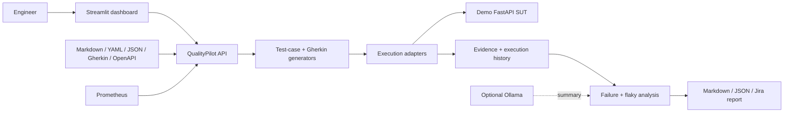
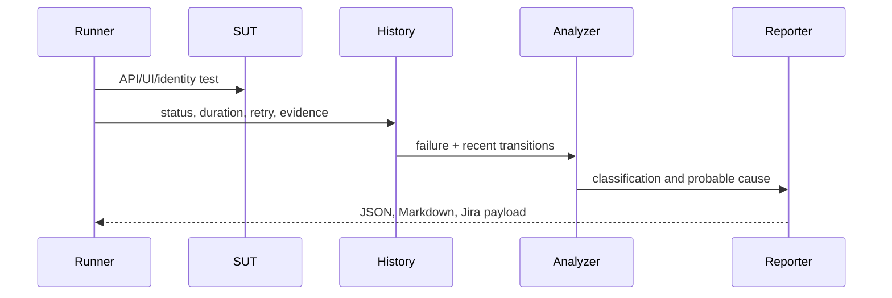

# QualityPilot Architecture

QualityPilot is a modular TestOps platform wrapped around a deliberately small enterprise system under test (SUT). The MVP is a modular monolith: simple to run locally, but split by typed adapter contracts so runners, storage, and model providers can be replaced independently.

## Components and data flow

- `app/demo_app` exposes registration, JWT login/refresh/logout, profile, admin, a tiny browser UI, health, and metrics.
- `app/backend` exposes requirement ingestion, generation, execution-history, analysis, reports, and AI-quality evaluation.
- `qualitypilot` contains domain models and adapters. HTTP layers contain no domain logic.
- `app/dashboard` calls the backend and renders current results and artifacts.
- SQLite stores users, refresh-token state, test executions, and defect metadata. Database URLs are configurable and use SQLAlchemy for PostgreSQL portability.
- Playwright, pytest/HTTPX, Behave, Schemathesis, and Locust are independent execution surfaces. The orchestrator launches only explicitly allow-listed commands.

## Adapter design

`qualitypilot.adapters.base` defines abstract interfaces for requirement sources, test generation, UI/API/BDD/security/load/AI testing, evidence, analysis, reporting, and defect tracking. MVP implementations are deterministic and local-first. Ollama is optional; no cloud key is required.

## Database model

- `User`: identity, password hash, role, mutable profile.
- `RefreshToken`: hashed token identifier, expiry, revocation, rotation lineage.
- `TestExecution`: result, timing, retry, signature, environment, browser, test-data version, evidence.
- `DefectRecord`: immutable rendered report metadata and artifact paths.

SQLite is appropriate for a single demo process. PostgreSQL is recommended for parallel workers; the models avoid SQLite-specific types.

## Security model

Passwords use PBKDF2-HMAC-SHA256 with per-password salts. Access JWTs are short-lived and signed with HS256; refresh tokens rotate and are stored by one-way JTI hash. Logout revokes the refresh family. Authorization is checked server-side. Login attempts are limited per client in a bounded in-memory window (Redis is the production path). Secrets come from environment variables. CSRF is not applicable to bearer-token APIs; if tokens move to cookies, add synchronizer tokens and `Secure`, `HttpOnly`, `SameSite` cookie controls.

Demo defect flags are disabled by default and rejected when `ENVIRONMENT=production`.

## Execution and failure flow

The analyzer uses transparent rules before optional language-model summarization. Flakiness is based on pass/fail transitions over a bounded recent window; it is a signal, not proof of a flaky test.

## Observability

ASGI middleware adds correlation IDs and JSON request logs. Prometheus counters and histograms cover requests, latency, executions, failure categories, and detected flaky tests. Test execution IDs flow in records and reports.

## CI/CD

The primary workflow installs Python and Node dependencies, starts the SUT, waits for health, then runs unit/API/identity/BDD/Playwright suites and uploads JUnit, Playwright, trace, screenshot, video, log, and defect artifacts. Separate CodeQL, dependency review, Docker, and optional ZAP workflows keep security concerns explicit.

## Tradeoffs

- A modular monolith avoids distributed-system overhead while preserving seams for queues and remote runners.
- In-process rate limiting and execution are suitable for a demo, not multi-instance production.
- Rule-based generation is repeatable and inspectable; it is less expressive than an LLM but works offline.
- The UI is intentionally server-rendered HTML plus Streamlit, keeping focus on quality engineering rather than frontend framework work.

