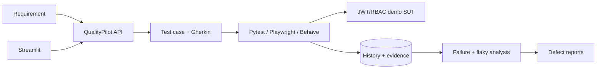

# QualityPilot

QualityPilot is a local-first, AI-assisted enterprise TestOps portfolio project. It converts requirements into validated test cases and Gherkin, exercises a real JWT/RBAC demo application through API and browser suites, records execution history and evidence, detects likely flaky tests, classifies failures, and produces professional defect reports. Its default path is deterministic and requires no paid API.

> Project status: active MVP. Implemented, experimental, and planned capabilities are listed below without implied production claims.

## Business problem

Quality work is often fragmented across requirements, test runners, CI artifacts, and issue trackers. QualityPilot keeps traceability and evidence in one inspectable workflow while making automation decisions reproducible.

## Architecture



See [ARCHITECTURE.md](ARCHITECTURE.md) for security, persistence, execution, CI/CD, and design tradeoffs.

## Screenshots

| Desktop login | Mobile validation |
|---|---|
|  |  |

## Quick start

Requires Python 3.11+ and Node 20+ for browser tests.

```bash
python3.12 -m venv .venv
.venv/bin/pip install -e '.[dev]'
cp .env.example .env
.venv/bin/uvicorn app.demo_app.main:app --reload --port 8000
```

In separate terminals:

```bash
.venv/bin/uvicorn app.backend.main:app --reload --port 8001
.venv/bin/streamlit run app/dashboard/main.py
```

API docs are at `http://localhost:8000/docs` and `http://localhost:8001/docs`. The demo login UI is at `http://localhost:8000`; users are created through `POST /api/register`.

## Docker

```bash
cp .env.example .env
docker compose up --build
```

This starts the demo app on 8000, QualityPilot API on 8001, and dashboard on 8501. SQLite history is persisted in a named volume.

## Run tests

```bash
.venv/bin/pytest
.venv/bin/behave tests/bdd
npm install
npx playwright install --with-deps chromium
npm test
```

Use `npm run test:cross-browser` for Chromium, Firefox, and WebKit projects. Schemathesis and Locust commands are documented beside their examples.

## Workflow example

```yaml
requirements:
  - id: AUTH-001
    title: User login
    description: A registered user signs in with valid credentials.
    acceptance_criteria:
      - Valid credentials return access and refresh tokens.
      - Invalid credentials return 401.
```

The rule-based generator emits Pydantic-validated positive, negative, boundary/security, API, and UI candidates with requirement IDs, priorities, data, steps, expected results, endpoints, and pages. Its generated feature preserves `AUTH-001` in tags and scenario text.

```json
{
  "test_id": "TC-AUTH-001-001",
  "title": "User login — Happy path",
  "requirement_id": "AUTH-001",
  "test_type": "functional",
  "priority": "high",
  "severity": "major",
  "automation_candidate": true,
  "related_endpoint": "/api/login",
  "related_ui_page": "/"
}
```

## Identity-flow demo

The SUT issues a short-lived signed access token plus a rotating refresh token. Refresh JTIs are stored as hashes, token replay is rejected, logout revokes the token family, and `/api/admin/audit` enforces server-side role checks. Tests cover missing, malformed, expired, wrong-type, revoked, and insufficient-role tokens.

## Intentional defect and flaky demo

Set one `DEFECT_*` variable only in a controlled local run, restart the SUT, and execute the relevant suite. For example, `DEFECT_DISABLE_REFRESH_ROTATION=true` makes the rotation identity test fail. `QUALITYPILOT_FLAKY_DEMO=true npm test` enables a deliberately timing-sensitive tagged Playwright test. All flags are off by default and configuration rejects them in production.

## AI quality

The demo agent answers only from a fixed knowledge base and requires approval for mutating tool actions. The deterministic evaluator checks injection resistance, groundedness/citations, schema, tool allow-lists, unsafe actions, approval gates, and a golden dataset. Ollama summaries are optional and never decide pass/fail.

## Capability status

| Capability | Status | Notes |
|---|---|---|
| Demo FastAPI SUT, JWT rotation/revocation, RBAC | Implemented | SQLite, local limiter |
| Requirement parsing, case/Gherkin generation | Implemented | Markdown/YAML/JSON/text/Gherkin/OpenAPI |
| pytest/HTTPX identity and API suites | Implemented | Includes OpenAPI schema assertions |
| Playwright POM, mobile/cross-browser, trace/video/screenshots | Implemented | Browser binaries installed separately |
| Behave traceability suite | Implemented | Primary BDD implementation |
| History, failure/flaky analysis, defect reports | Implemented | Deterministic local engine |
| Streamlit dashboard and metrics | Implemented | Local operator UI |
| AI-quality and mock stream validation | Implemented | Deterministic examples |
| Schemathesis, axe, visual, Locust, ZAP | Experimental | Working examples/workflows; opt-in dependencies |
| PostgreSQL, distributed workers, Jira writes | Planned | Adapter seams/payload only |
| Next.js, Kafka, cloud deployment | Planned | Architecture roadmap |

## Security notes

Do not reuse `.env.example` secrets, commit tokens, or store Playwright auth state. Demo flags deliberately weaken behavior and are blocked in production configuration. See [SECURITY.md](SECURITY.md) for the threat model and limitations.

## CI/CD and artifacts

GitHub Actions lint and run Python, API, identity, BDD, and Playwright suites against a health-checked SUT. JUnit, HTML, traces, screenshots, videos, logs, and generated reports are uploaded even when a suite fails; job status still reflects failures. CodeQL and Dependabot are configured separately.

## Roadmap

- PostgreSQL integration and queue-backed remote runners
- Real Jira/Linear adapter with explicit write approval
- Kafka-compatible broker test container
- Optional OpenAI-compatible provider
- Next.js dashboard only after backend maturity

## Interview demo

Follow [docs/INTERVIEW_DEMO.md](docs/INTERVIEW_DEMO.md) for a five-minute flow. Accurate implementation-only bullets are in [docs/RESUME_BULLETS.md](docs/RESUME_BULLETS.md).
