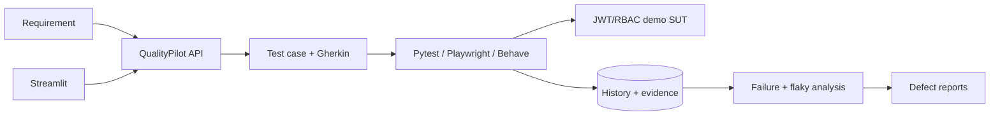
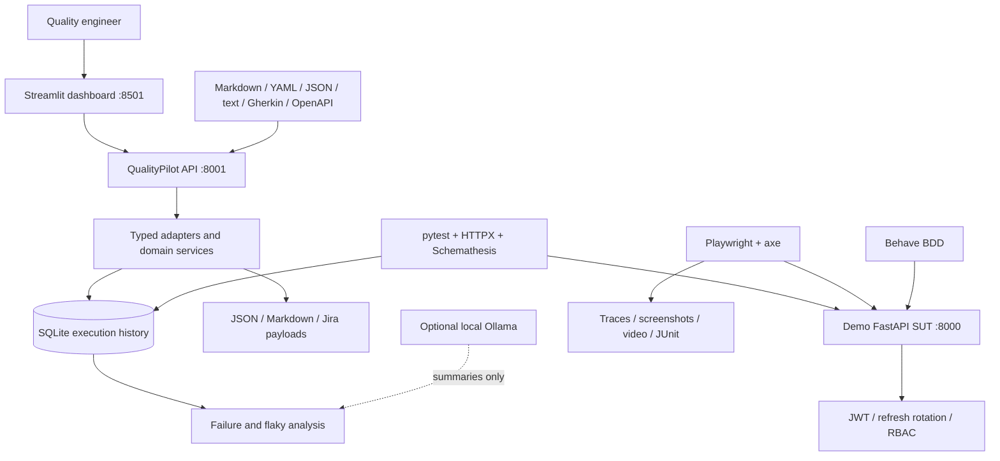
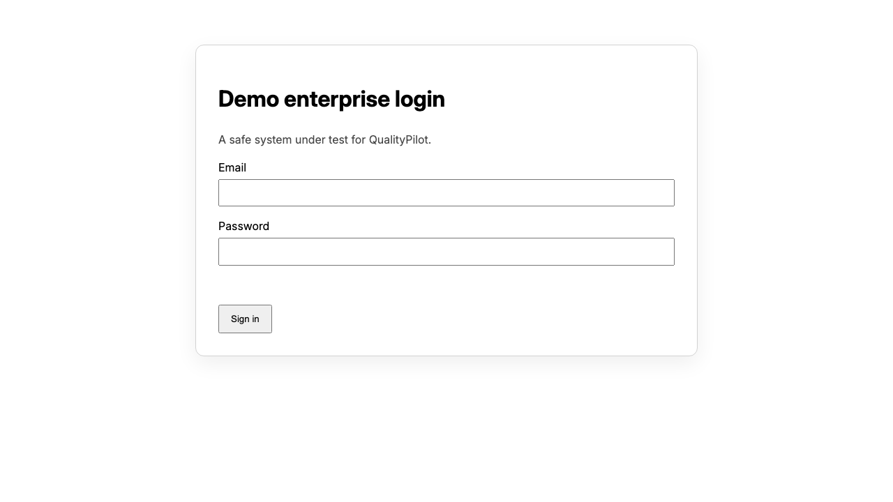
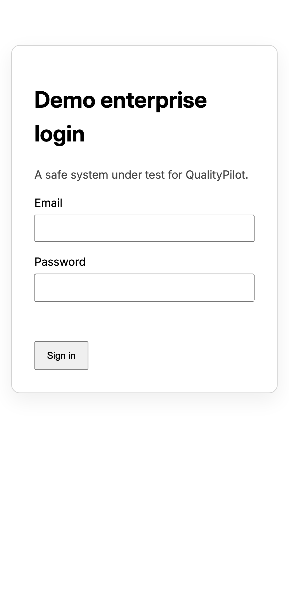

# QualityPilot

QualityPilot is a local-first, AI-assisted enterprise TestOps portfolio project. It converts requirements into validated test cases and Gherkin, exercises a real JWT/RBAC demo application through API and browser suites, records execution history and evidence, detects likely flaky tests, classifies failures, and produces professional defect reports. Its default path is deterministic and requires no paid API.

> Project status: active MVP. Implemented, experimental, and planned capabilities are listed below without implied production claims.

## Table of contents

- [Why this project is useful](#why-this-project-is-useful)
- [Business problem](#business-problem)
- [Architecture](#architecture)
- [Technology inventory](#technology-inventory)
- [Repository structure](#repository-structure)
- [Local installation](#local-installation)
- [Docker installation](#docker-installation)
- [Using the platform](#using-the-platform)
- [Testing](#testing)
- [Identity and security](#identity-and-security)
- [Failure, flaky-test, and defect workflows](#failure-flaky-test-and-defect-workflows)
- [AI and event quality](#ai-and-event-quality)
- [CI/CD](#cicd)
- [Configuration](#configuration)
- [Capability status](#capability-status)
- [Troubleshooting](#troubleshooting)
- [Roadmap and limitations](#roadmap-and-limitations)

## Why this project is useful

QualityPilot demonstrates how a quality engineer can connect the full testing lifecycle instead of maintaining isolated test scripts. A requirement enters once, becomes structured test cases and traceable Gherkin, runs against realistic API and browser identity flows, produces evidence, and feeds explainable failure, flaky-test, and defect-reporting workflows.

It is useful for:

- Quality and automation engineers who want a working reference for API, UI, BDD, identity, security, accessibility, contract, and reliability testing.
- Engineering teams evaluating how requirement traceability and execution evidence can live in one workflow.
- Interview and portfolio demonstrations that need more depth than a single test framework sample.
- Local experimentation with AI-agent quality checks without purchasing an API subscription.
- Learning secure JWT and RBAC validation through both positive and adversarial automated tests.

The platform is deliberately local-first. Its default generation and analysis logic is deterministic, inspectable, and repeatable. Optional Ollama support can improve prose summaries, but never changes the deterministic verdict.

## Business problem

Quality work is often fragmented across requirements, test runners, CI artifacts, and issue trackers. QualityPilot keeps traceability and evidence in one inspectable workflow while making automation decisions reproducible.

## Architecture



See [ARCHITECTURE.md](ARCHITECTURE.md) for security, persistence, execution, CI/CD, and design tradeoffs.

### Runtime components



## Screenshots

| Desktop login | Mobile validation |
|---|---|
|  |  |

## Technology inventory

Everything required for the default local path is free and open source.

| Area | Technology | How it is used |
|---|---|---|
| Language | Python 3.11+ | APIs, domain services, analyzers, persistence, BDD steps, and test suites |
| Control API and SUT | FastAPI, Uvicorn, Pydantic | Typed HTTP APIs, OpenAPI documentation, validation, and local services |
| Persistence | SQLAlchemy, SQLite | Users, refresh-token state, execution history, and defect metadata |
| Dashboard | Streamlit, pandas | Requirement lab, metrics, execution history, defects, flaky tests, and AI checks |
| API testing | pytest, HTTPX | Functional, negative, identity, RBAC, security, and state-change tests |
| Contract testing | Schemathesis | OpenAPI operation discovery and response validation |
| Browser testing | Playwright Test, TypeScript | Page Objects, login/logout, sessions, profile, responsive, and cross-browser flows |
| Accessibility | axe-core for Playwright | Automated serious and critical accessibility checks |
| BDD | Behave, Gherkin | Feature scenarios, outlines, reusable steps, tags, and requirement traceability |
| Load testing | Locust | Opt-in health and invalid-login load profile |
| AI quality | Deterministic Python adapter, optional Ollama | Injection, grounding, citation, schema, tool, approval, and golden-data checks |
| Event quality | JSON Schema | Duplicate, ordering, invalid-event, and dead-letter validation |
| Metrics | Prometheus Python client | HTTP counts, latency, executions, classifications, and flaky-test signals |
| Containers | Docker, Docker Compose | Repeatable three-service local stack and persistent data volumes |
| CI and security | GitHub Actions, CodeQL, Dependabot, OWASP ZAP | Automated suites, builds, artifact retention, dependency updates, and scans |
| Code quality | Ruff, mypy configuration, ESLint, Prettier, TypeScript | Formatting, linting, and static type checks |

No OpenAI, Anthropic, Jira, cloud, or paid model API is required.

## Repository structure

```text
app/
  backend/                 QualityPilot control-plane API
  dashboard/               Streamlit operator dashboard
  demo_app/                JWT/RBAC system under test and browser UI
qualitypilot/
  adapters/                Abstract extension contracts
  requirements/            Requirement normalization
  generators/              Test-case and Gherkin generation
  execution/               Allow-listed suite orchestration
  evidence/                Artifact manifest collection
  analysis/                Deterministic failure classification
  flaky_detection/         Execution history and transition scoring
  defect_reporting/        Markdown, JSON, and Jira-compatible reports
  ai_quality/              Demo agent, evaluator, and Ollama provider
  observability/           JSON request logging and Prometheus metrics
  security/                Password and JWT helpers
  streaming/               Event schema, ordering, duplicate, and DLQ checks
tests/
  unit/ api/ identity/ security/ bdd/ load/
playwright/                 TypeScript Page Objects and UI suites
requirements/              Sample stories and feature files
reports/                    Sanitized sample reports and generated output location
docs/                       Interview guide, resume bullets, and screenshots
.github/                    CI, CodeQL, ZAP, Dependabot, and issue template
```

## Local installation

Requires Python 3.11+ and Node 20+ for browser tests.

### 1. Clone and configure

```bash
git clone https://github.com/virinchisai/QualityPilot.git
cd QualityPilot
cp .env.example .env
```

Generate a unique development secret before sharing the environment:

```bash
python3 -c "import secrets; print(secrets.token_urlsafe(48))"
```

Set that output as `JWT_SECRET` in `.env`.

### 2. Install Python dependencies

```bash
python3.12 -m venv .venv
.venv/bin/pip install -e '.[dev]'
```

On Windows PowerShell, activate with `.venv\Scripts\Activate.ps1` and replace `.venv/bin/` commands with `.venv\Scripts\`.

### 3. Install browser dependencies

```bash
npm install
npx playwright install chromium
```

Install all three desktop engines with `npx playwright install chromium firefox webkit` when running the complete cross-browser suite.

### 4. Start the services

Terminal 1 — demo system under test:

```bash
.venv/bin/uvicorn app.demo_app.main:app --reload --port 8000
```

Terminal 2 — QualityPilot API:

```bash
.venv/bin/uvicorn app.backend.main:app --reload --port 8001
```

Terminal 3 — dashboard:

```bash
.venv/bin/streamlit run app/dashboard/main.py
```

### 5. Open the applications

| Surface | URL |
|---|---|
| Demo login UI | `http://localhost:8000` |
| Demo SUT OpenAPI | `http://localhost:8000/docs` |
| QualityPilot OpenAPI | `http://localhost:8001/docs` |
| Streamlit dashboard | `http://localhost:8501` |
| Demo SUT metrics | `http://localhost:8000/metrics` |
| QualityPilot metrics | `http://localhost:8001/metrics` |

## Docker installation

```bash
cp .env.example .env
docker compose up --build
```

This starts the demo app on 8000, QualityPilot API on 8001, and dashboard on 8501. SQLite history is persisted in a named volume.

Useful lifecycle commands:

```bash
docker compose ps
docker compose logs -f
docker compose down
docker compose down -v  # also removes the local named data volumes
```

The final command deletes containerized local history. Use it only when that reset is intentional.

## Using the platform

1. Open **Requirement Lab** in the dashboard.
2. Choose Markdown, YAML, JSON, text, Gherkin, or OpenAPI.
3. Paste a requirement or start with the supplied login sample.
4. Generate Pydantic-validated cases and traceable Gherkin.
5. Run API, identity, BDD, or Playwright suites from the documented commands.
6. POST actual execution results to `/api/executions` or use the allow-listed runner in an integration.
7. Inspect execution history, pass rate, durations, failure signatures, and flaky scores.
8. Submit failure evidence to `/api/failures/analyze`.
9. Generate persistent Markdown, JSON, and Jira-compatible defect output through `/api/defects`.
10. Exercise the AI-quality tab with grounded and adversarial prompts.

Sample requirements are available in `requirements/user_stories.yaml`, `requirements/user_stories.md`, and `requirements/features/`.

## Testing

### Python, API, identity, and security

```bash
.venv/bin/pytest
```

Focused commands:

```bash
.venv/bin/pytest tests/unit -q
.venv/bin/pytest tests/api -q
.venv/bin/pytest tests/identity tests/security -q
```

### BDD

```bash
.venv/bin/behave tests/bdd
.venv/bin/python scripts/check_duplicate_steps.py
```

Behave is the primary implementation. A Cucumber.js adapter can consume the same generated feature text and traceability tags without changing the domain model.

### Playwright

```bash
npm test
npm run test:mobile
npm run test:cross-browser
```

Playwright retains traces, screenshots, and videos on failure. HTML output appears in `playwright-report/`; test artifacts appear in `test-results/`; JUnit is written to `reports/playwright-junit.xml`.

### Code-quality checks

```bash
.venv/bin/ruff format --check .
.venv/bin/ruff check .
npm run format:check
npm run lint
npm run typecheck
```

### Load test

Install the optional load extra, start the SUT, and run a bounded local profile:

```bash
.venv/bin/pip install -e '.[load]'
.venv/bin/locust -f tests/load/locustfile.py --host http://localhost:8000 \
  --headless -u 10 -r 2 -t 30s
```

Do not point the load profile at infrastructure without authorization.

## Workflow example

```yaml
requirements:
  - id: AUTH-001
    title: User login
    description: A registered user signs in with valid credentials.
    acceptance_criteria:
      - Valid credentials return access and refresh tokens.
      - Invalid credentials return 401.
```

The rule-based generator emits Pydantic-validated positive, negative, boundary/security, API, and UI candidates with requirement IDs, priorities, data, steps, expected results, endpoints, and pages. Its generated feature preserves `AUTH-001` in tags and scenario text.

```json
{
  "test_id": "TC-AUTH-001-001",
  "title": "User login — Happy path",
  "requirement_id": "AUTH-001",
  "test_type": "functional",
  "priority": "high",
  "severity": "major",
  "automation_candidate": true,
  "related_endpoint": "/api/login",
  "related_ui_page": "/"
}
```

## Identity and security

The SUT issues a short-lived signed access token plus a rotating refresh token. Refresh JTIs are stored as hashes, token replay is rejected, logout revokes the token family, and `/api/admin/audit` enforces server-side role checks. Tests cover missing, malformed, expired, wrong-type, revoked, and insufficient-role tokens.

Passwords use salted PBKDF2-HMAC-SHA256. Access and refresh JWTs explicitly restrict verification to HS256. The login limiter is intentionally process-local for the MVP. Demo defect flags are rejected when `ENVIRONMENT=production`.

The API uses bearer tokens rather than authentication cookies, so cookie-based CSRF is not part of the current flow. If tokens move to cookies, add `Secure`, `HttpOnly`, `SameSite`, explicit CSRF controls, and cookie-scope tests. Review [SECURITY.md](SECURITY.md) before exposing any component outside a local environment.

## Failure, flaky-test, and defect workflows

The deterministic failure analyzer classifies evidence into application defects, test defects, flaky behavior, environment issues, dependency failures, authentication failures, authorization failures, data issues, or unknown. Each result contains confidence, probable cause, affected component, owner, next action, evidence, and retry guidance.

Flakiness uses up to 20 recent executions. Its score combines pass/fail transitions with retry usage and provides cause-specific stabilization advice for timing, locators, data, or retry masking. It is a triage signal—not proof that a test is flaky.

Defect reports include reproduction steps, expected and actual behavior, environment, build, evidence references, request/response data, suspected cause, owner, labels, and timestamps. Output is available as JSON, Markdown, and a Jira-compatible payload. The included Jira endpoint is mock-only and does not create external issues.

### Controlled defect demonstration

Set one `DEFECT_*` variable only in a controlled local run, restart the SUT, and execute the relevant suite. For example, `DEFECT_DISABLE_REFRESH_ROTATION=true` makes the rotation identity test fail. `QUALITYPILOT_FLAKY_DEMO=true npm test` enables a deliberately timing-sensitive tagged Playwright test. All flags are off by default and configuration rejects them in production.

Available local fault modes cover refresh rotation, expired tokens, admin authorization, response delay, status codes, selectors, intermittent failures, and malformed JSON. Never enable them in a shared or production environment.

## AI and event quality

### AI quality

The demo agent answers only from a fixed knowledge base and requires approval for mutating tool actions. The deterministic evaluator checks injection resistance, groundedness/citations, schema, tool allow-lists, unsafe actions, approval gates, and a golden dataset. Ollama summaries are optional and never decide pass/fail.

The golden dataset is stored at `examples/ai_golden_dataset.json`. To use Ollama, install it separately, pull a small local model, and configure `OLLAMA_URL` and `OLLAMA_MODEL`. The rest of QualityPilot works when Ollama is absent.

### Event and streaming quality

`qualitypilot.streaming.validator` validates JSON Schema conformance, duplicate event IDs, per-aggregate ordering, and dead-letter candidates. It demonstrates Kafka-compatible event semantics without requiring a broker. The event schema example is in `examples/event_schema.json`; a real Kafka deployment remains planned.

## Capability status

| Capability | Status | Notes |
|---|---|---|
| Demo FastAPI SUT, JWT rotation/revocation, RBAC | Implemented | SQLite, local limiter |
| Requirement parsing, case/Gherkin generation | Implemented | Markdown/YAML/JSON/text/Gherkin/OpenAPI |
| pytest/HTTPX identity and API suites | Implemented | Includes OpenAPI schema assertions |
| Playwright POM, mobile/cross-browser, trace/video/screenshots | Implemented | Browser binaries installed separately |
| Behave traceability suite | Implemented | Primary BDD implementation |
| History, failure/flaky analysis, defect reports | Implemented | Deterministic local engine |
| Streamlit dashboard and metrics | Implemented | Local operator UI |
| AI-quality and mock stream validation | Implemented | Deterministic examples |
| Schemathesis, axe, visual, Locust, ZAP | Experimental | Working examples/workflows; opt-in dependencies |
| PostgreSQL, distributed workers, Jira writes | Planned | Adapter seams/payload only |
| Next.js, Kafka, cloud deployment | Planned | Architecture roadmap |

## Configuration

| Variable | Default | Purpose |
|---|---|---|
| `ENVIRONMENT` | `development` | Activates production safety validation when set to `production` |
| `DATABASE_URL` | `sqlite:///./qualitypilot.db` | SQLAlchemy connection string |
| `JWT_SECRET` | local example | JWT signing secret; replace outside disposable local use |
| `ACCESS_TOKEN_MINUTES` | `15` | Access-token lifetime |
| `REFRESH_TOKEN_MINUTES` | `1440` | Refresh-token lifetime |
| `LOGIN_RATE_LIMIT` | `5` | Attempts allowed in the local window |
| `LOGIN_RATE_WINDOW_SECONDS` | `60` | Sliding-window duration |
| `QUALITYPILOT_API_URL` | `http://localhost:8001` | Dashboard control API location |
| `DEMO_APP_URL` | `http://localhost:8000` | Playwright SUT location |
| `OLLAMA_URL` | `http://localhost:11434` | Optional local Ollama endpoint |
| `OLLAMA_MODEL` | `qwen2.5:3b` | Optional local summarization model |
| `DEFECT_*` | disabled | Controlled local fault injection flags |

See `.env.example` for every supported variable. Do not commit `.env`.

## Security notes

Do not reuse `.env.example` secrets, commit tokens, or store Playwright auth state. Demo flags deliberately weaken behavior and are blocked in production configuration. See [SECURITY.md](SECURITY.md) for the threat model and limitations.

## CI/CD

GitHub Actions lint and run Python, API, identity, BDD, and Playwright suites against a health-checked SUT. JUnit, HTML, traces, screenshots, videos, logs, and generated reports are uploaded even when a suite fails; job status still reflects failures. CodeQL and Dependabot are configured separately.

| Workflow | Responsibility |
|---|---|
| `ci.yml` | Ruff, pytest, Behave, duplicate-step checks, ESLint, Prettier, TypeScript, Playwright, Docker build, summaries, and artifacts |
| `codeql.yml` | Scheduled and pull-request Python/JavaScript security analysis |
| `zap.yml` | Manually triggered OWASP ZAP baseline against the local SUT |
| `dependabot.yml` | Weekly pip, npm, and GitHub Actions dependency updates |

The workflow fails when a required suite fails while still preserving diagnostic artifacts through `if: always()` upload steps.

## Troubleshooting

- **Port already in use:** stop the existing process or select another port and update the matching URL variable.
- **Dashboard says API unavailable:** verify `curl http://localhost:8001/health` and `QUALITYPILOT_API_URL`.
- **Playwright cannot find a browser:** run `npx playwright install chromium`.
- **Tests unexpectedly receive 429:** use isolated emails, allow the limiter window to expire, or restart the disposable local SUT. Do not disable production protection as a fix.
- **SQLite is locked:** stop duplicate local writers. Use PostgreSQL when introducing parallel or distributed execution.
- **Docker build cannot connect:** start Docker Desktop or another compatible Docker daemon.
- **Ollama is unavailable:** leave it stopped; deterministic evaluation and failure classification continue to work.
- **Defect flag has no effect:** restart the SUT after changing `.env`, and confirm `ENVIRONMENT` is not `production`.

## Roadmap and limitations

Implemented functionality is suitable for local demonstration and engineering exploration, not direct internet-facing production use. Known MVP limitations include process-local rate limiting, synchronous execution, SQLite concurrency constraints, shared-secret JWT signing, no distributed worker queue, no real external defect write, and no cloud infrastructure.

- PostgreSQL integration and queue-backed remote runners
- Real Jira/Linear adapter with explicit write approval
- Kafka-compatible broker test container
- Optional OpenAI-compatible provider
- Next.js dashboard only after backend maturity

## Interview demo

Follow [docs/INTERVIEW_DEMO.md](docs/INTERVIEW_DEMO.md) for a five-minute flow. Accurate implementation-only bullets are in [docs/RESUME_BULLETS.md](docs/RESUME_BULLETS.md).

Additional project references:

- [Architecture and tradeoffs](ARCHITECTURE.md)
- [Implementation phases](IMPLEMENTATION_PLAN.md)
- [Completed task checklist](TASKS.md)
- [Security policy and threat model](SECURITY.md)
- [Contribution standards](CONTRIBUTING.md)
- [Change history](CHANGELOG.md)
- [Sample defect report](reports/sample-defect.md)

## License

QualityPilot is available under the [MIT License](LICENSE).
